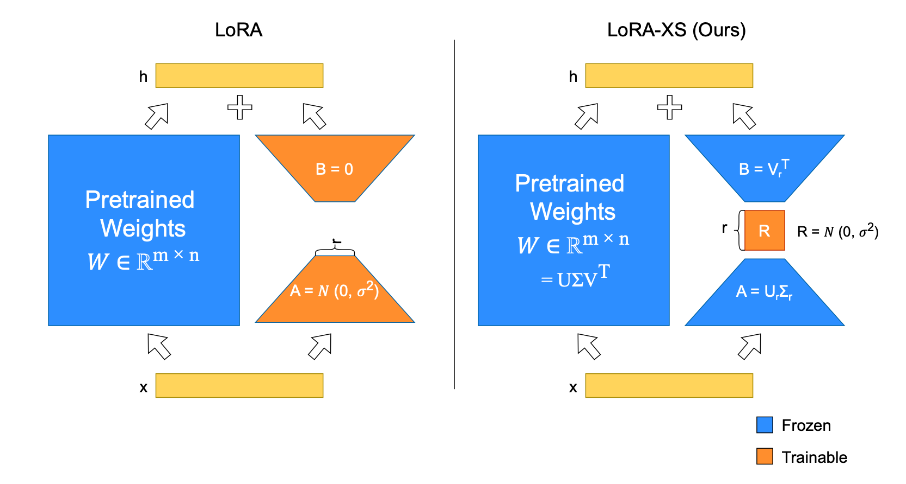

# LoRA-XS: Low-Rank Adaptation with Extremely Small Number of Parameters

Code for the paper: "[LoRA-XS: Low-Rank Adaptation with Extremely Small Number of Parameters](https://arxiv.org/abs/2405.17604)"

## Introduction
We introduce LoRA-XS (**Lo**w-**R**ank **A**daptation with e**X**tremely **S**mall number of parameters), a novel approach leveraging Singular Value Decomposition (SVD) for parameter-efficient fine-tuning. LoRA-XS introduces a small r x r weight matrix between frozen LoRA matrices, which are constructed by SVD of the original weight matrix. Training only r x r weight matrices ensures independence from model dimensions, enabling more parameter-efficient fine-tuning, especially for larger models. LoRA-XS achieves a remarkable reduction of trainable parameters by over 100x in 7B models compared to LoRA. Our benchmarking across various scales, including GLUE, GSM8k, and MATH benchmarks, shows that our approach outperforms LoRA and recent state-of-the-art approaches like VeRA in terms of parameter efficiency while maintaining competitive performance.


<p align="center">
  
  <br> Visual comparison of LoRA and <b>LoRA-XS</b> techniques. The key distinction of LoRA-XS lies in its use of a small<br> trainable matrix <b>R</b> between frozen low-rank matrices A and B derived from truncated SVD of pretrained weights.
</p>
  

## Requirements
We recommend running the scripts inside a conda environment.
You can run the following commands to create the conda environment, as well as installing needed libraries:
```bash
conda create -n loraxs python=3.8.13
conda activate loraxs
pip install -r requirements.txt
```

## GLUE Experiments
**Note**: Feel free to limit the grid search in the following scripts if you want to train the model with a specific hyperparameter.
### Training from scratch
To reproduce our GLUE results for CoLA, SST-2 and QNLI tasks, please run the `scripts/run_glue.py` script as follows (using QNLI dataset as an example):
```bash
python scripts/run_glue.py --target_task qnli
```
### Training from MNLI-tuned models
Similar to previous work, the GLUE experiments on MRPC, RTE and STS-B tasks are initialized from an MNLI-tuned model.
Please run the `scripts/run_glue_pretrained.py` script as follows (using MRPC dataset as an example).
Please note that you need to put your MNLI-tuned models in the `model_checkpoints` directory before running the script. We provide MNLI-tuned (using LoRA-XS) checkpoints with various ranks for the RoBERTa-large model [here](https://drive.google.com/drive/folders/1qGeAvSvG-iRhTopyhIhi55LIUoRSsMob?usp=share_link).
```bash
python scripts/run_glue_pretrained.py --target_task mrpc
```
### Random versus SVD-based initialization
In order to run the LoRA-XS training with a random initialization (instead of the SVD-based initialization),
please run the following script (using QNLI as an example):
```bash
python scripts/run_glue_no_svd.py --target_task qnli
```
## Instruction Tuning Experiments
In order to run the instruction tuning experiment in the paper, where the model is trained on the MetaMathQA dataset
and then evaluted on GSM8K and MATH benchmarks, please run the following bash script.
If you want to fine-tune different pretrained model (current default is a Mistral-7B model),
feel free to change the `BASE_MODEL` variable in the `scripts/run_instruction_tuning.sh` script. 
```bash
bash scripts/run_instruction_tuning.sh 
```
## Citation
If you use this code for your research, please cite the following paper:
```
@article{balazy2024lora,
  title={LoRA-XS: Low-Rank Adaptation with Extremely Small Number of Parameters},
  author={Ba{\l}azy, Klaudia and Banaei, Mohammadreza and Aberer, Karl and Tabor, Jacek},
  journal={arXiv preprint arXiv:2405.17604},
  year={2024}
}
```

